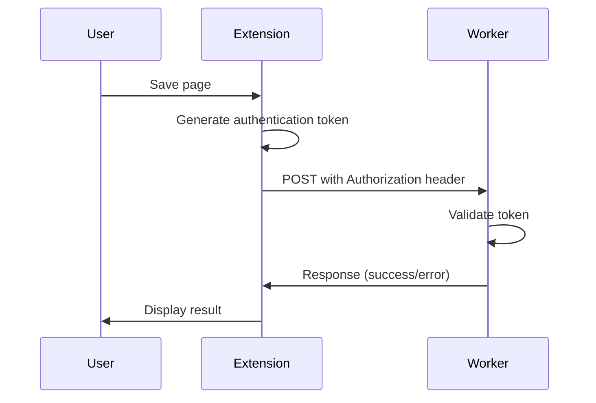

# Bondwise Extension Authentication Fix Plan

## 📋 Problem Analysis

Based on thorough code examination, I've identified an authentication mismatch between the Bondwise browser extension and the Cloudflare Worker API:

1. **Extension Side**:
   - Uses a simple email-based userId stored in chrome.storage.local
   - Makes API requests WITHOUT any Authorization header
   - No token generation or management implemented

2. **Worker API Side**:
   - Uses Clerk authentication system
   - Explicitly checks for and requires an Authorization Bearer token
   - Returns 401 "Missing Authorization Bearer token" when token is absent

3. **Error in Logs**:
   ```
   Worker API response (401): {"status":"error","message":"Missing Authorization Bearer token"}
   ```

This explains why saves to the Worker API fail with 401 errors while local storage fallback still works.

## 🔧 Solution Options

I've identified three potential approaches to fix this authentication mismatch:

1. **Full Clerk Integration**: Implement complete Clerk authentication in the extension
2. **Simplified Token System**: Create a simple but secure token system for the extension
3. **Development Bypass**: Add a temporary authentication bypass in the Worker

## 📝 Recommended Approach

I recommend a **two-phase approach**:

1. **Phase 1 (Immediate Fix)**: Implement a simplified token-based authentication system
2. **Phase 2 (Long-term Solution)**: Plan for full Clerk authentication integration

This approach provides immediate functionality while setting a path toward a more robust long-term solution.

## 🔍 Phase 1: Simplified Token Authentication

### Extension Updates (background.ts)

```typescript
// Add this function to generate and manage authentication tokens
async function getAuthToken(): Promise<string | null> {
  // First check if we have a valid stored token
  const storedToken = await chrome.storage.local.get(["authToken", "authTokenExpiry"]);

  // Check if token exists and is not expired (24-hour validity)
  if (storedToken.authToken &&
      storedToken.authTokenExpiry &&
      Date.now() < storedToken.authTokenExpiry) {
    return storedToken.authToken;
  }

  // If no token or expired, get the userId (email)
  const userIdResult = await chrome.storage.local.get(["userId"]);
  if (!userIdResult.userId) {
    console.error("No user ID found. Please set up your email first.");
    return null;
  }

  // Generate a simple token based on user email + timestamp + shared secret
  // Format: base64(email:timestamp:signature)
  // where signature is base64(email:timestamp:SECRET_KEY)
  const timestamp = Date.now();
  const email = userIdResult.userId;
  const SECRET_KEY = "bondwise-secure-key-2025"; // This would be better stored securely

  // Create signature using email and timestamp
  const signatureInput = `${email}:${timestamp}:${SECRET_KEY}`;
  const signature = btoa(signatureInput);

  // Create the final token
  const token = btoa(`${email}:${timestamp}:${signature}`);

  // Store token with 24-hour expiry
  const expiryTime = timestamp + (24 * 60 * 60 * 1000);
  await chrome.storage.local.set({
    authToken: token,
    authTokenExpiry: expiryTime
  });

  return token;
}

// Update the fetch call in the existing code to include Authorization header
try {
  console.log(`Attempting to POST item to Worker: ${workerUrl}`, newItem);

  // Get authentication token
  const token = await getAuthToken();
  if (!token) {
    throw new Error("Failed to generate authentication token");
  }

  const response = await fetch(workerUrl, {
    method: "POST",
    headers: {
      "Content-Type": "application/json",
      "Authorization": `Bearer ${token}`  // Add token to request
    },
    body: JSON.stringify(newItem),
  });

  // Rest of the existing code...
```

### Worker Updates (auth.ts)

```typescript
/**
 * Authenticates an incoming request using Clerk or simplified token.
 */
export async function authenticateRequestWithClerk(
  request: Request,
  env: Env,
): Promise<AuthResult> {
  // Check for Authorization header
  const authHeader = request.headers.get("Authorization");
  if (!authHeader || !authHeader.startsWith("Bearer ")) {
    console.warn("Authentication failed: Missing Authorization Bearer token.");
    return {
      status: "error",
      response: errorResponse("Missing Authorization Bearer token", 401),
    };
  }

  const token = authHeader.substring(7); // Remove "Bearer " prefix

  // First try to validate as a simplified token
  try {
    const decodedToken = atob(token);
    const tokenParts = decodedToken.split(':');

    if (tokenParts.length === 3) {
      const [email, timestamp, signature] = tokenParts;

      // Verify the token isn't too old (24 hour validity)
      const tokenAge = Date.now() - Number(timestamp);
      if (tokenAge > 24 * 60 * 60 * 1000) {
        return {
          status: "error",
          response: errorResponse("Token expired", 401),
        };
      }

      // Decode and verify signature
      try {
        const decodedSignature = atob(signature);
        const signatureParts = decodedSignature.split(':');

        if (signatureParts.length === 3) {
          const [sigEmail, sigTimestamp, secret] = signatureParts;

          // Verify all parts match and secret is correct
          if (sigEmail === email &&
              sigTimestamp === timestamp &&
              secret === "bondwise-secure-key-2025") {

            console.log(`Simplified token authentication successful for: ${email}`);
            return { status: "success", userId: email };
          }
        }
      } catch (e) {
        // Signature decode failed, continue to Clerk auth
        console.log("Simplified token signature validation failed, trying Clerk");
      }
    }
  } catch (e) {
    // Token decode failed, continue to Clerk auth
    console.log("Simplified token format invalid, trying Clerk");
  }

  // If simplified token validation fails, try Clerk authentication
  try {
    const clerk = createClerkClient({ secretKey: env.CLERK_SECRET_KEY });

    // Use Clerk's robust request authentication
    const requestState = await clerk.authenticateRequest(request, {
      secretKey: env.CLERK_SECRET_KEY,
      publishableKey: env.CLERK_PUBLISHABLE_KEY,
    });

    // Rest of existing Clerk authentication code...
```

## 📝 Phase 2: Long-term Authentication Solution

For a more robust long-term solution, I recommend:

1. **Full Clerk Integration**:
   - Implement Clerk's browser SDK in the extension
   - Create a proper user sign-in flow
   - Securely manage and refresh Clerk session tokens

2. **Token Management Improvements**:
   - Implement proper token refresh mechanisms
   - Handle token expiration gracefully
   - Provide clear user feedback for authentication issues

3. **Security Enhancements**:
   - Use secure storage for sensitive information
   - Implement proper PKCE-based OAuth flows if needed
   - Add additional security measures like device binding

## 🚀 Implementation Steps

### 1. Immediate Fix Implementation

1. Update `background.ts` in the extension with the token generation function
2. Modify the API request code to include the Authorization header
3. Update `auth.ts` in the Worker to handle the simplified token format
4. Test the authentication flow thoroughly

### 2. Testing Procedure

1. Set up the extension with an email address
2. Try saving several different types of content
3. Verify successful saving by checking the Cloudflare Worker logs
4. Test token expiration by manipulating the stored token expiry
5. Verify error handling for invalid tokens

### 3. Deployment Strategy

1. Deploy the Worker updates first
2. Test that the Worker still works with existing authentication
3. Deploy the extension updates
4. Monitor for any authentication errors or issues

## 📊 Success Metrics

The implementation will be considered successful when:

1. The extension can successfully save content to the Worker API
2. No 401 authentication errors occur during normal usage
3. The token system correctly handles expiration and renewal
4. The local storage fallback continues to work as expected

## 📚 Technical Background

### Authentication Flow Diagram



### Security Considerations

The simplified token system provides:
- Basic authentication between extension and Worker
- Token expiration to limit validity period
- Signature verification to prevent tampering
- User identification for proper data access control

While not as robust as full Clerk authentication, this approach provides a reasonable security level for the immediate solution while we work toward the more comprehensive long-term approach.