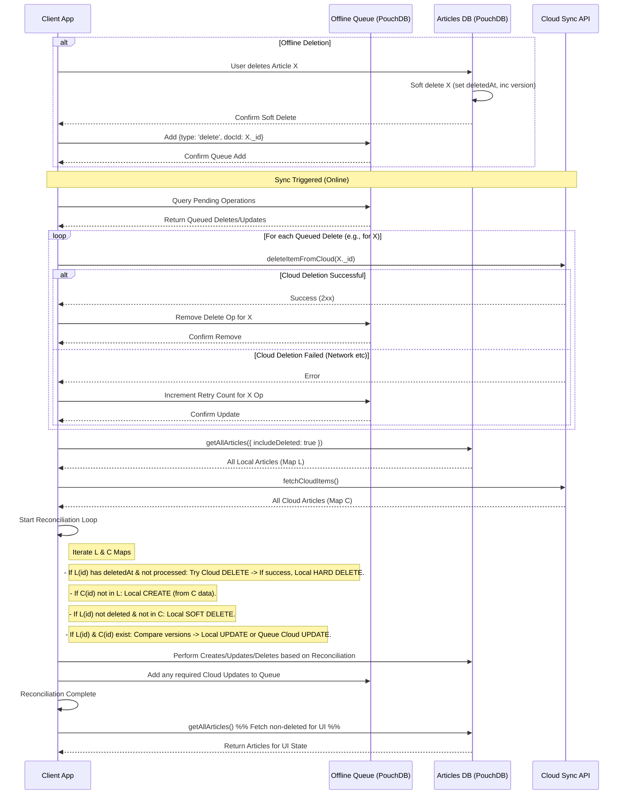

# Plan: Cloud Sync Deletion Fix (Soft Delete & Reconciliation)

**Date:** 2025-04-03

**Goal:** Ensure articles deleted locally are correctly removed from the cloud during sync and do not reappear, while handling offline scenarios gracefully.

**Problem:** Articles deleted locally reappear after the automatic cloud synchronization process runs.

**Root Cause:**
1.  **Local Hard Deletes:** `deleteArticle` performs a hard delete (`articlesDb.remove`).
2.  **One-Way Sync Overwrite:** `useArticleSync` fetches all cloud items and overwrites local state via `bulkSaveArticles`.
3.  **No Deletion Sync to Cloud:** `deleteItemFromCloud` exists but isn't used in the regular sync loop, so the cloud is unaware of local deletions.

**Strategy:** Implement soft deletes locally, use versioning for conflict resolution, reconcile local and cloud states during sync, and manage offline operations via a queue.

**Detailed Steps:**

1.  **Schema Enhancement (`src/services/db/types.ts`):**
    *   Modify the `Article` interface:
        *   Add `deletedAt?: number;` (Timestamp for when soft delete occurred).
        *   Add `version: number;` (Monotonically increasing number, incremented on every change). Initialize to `1` for new articles.

2.  **Offline Queue Setup:**
    *   Create a new PouchDB instance for queueing offline operations (e.g., `operations_queue`).
    *   Define an interface for queued operations: `interface QueuedOperation { _id: string; type: 'delete' | 'update'; docId: string; timestamp: number; retryCount: number; data?: Partial<Article> };`.

3.  **Update Local CRUD Operations (`src/services/db/articles.ts`):**
    *   **`saveArticle` / `updateArticle` / `bulkSaveArticles`:**
        *   Increment `version` on every save/update. Use cloud version if higher during merge, otherwise increment local.
        *   Ensure `deletedAt` is unset when creating/updating non-deleted articles.
        *   *(Optional)*: Queue `update` operations if offline.
    *   **`deleteArticle`:**
        *   Fetch the current article.
        *   Set `deletedAt = Date.now()`.
        *   Increment `version`.
        *   Save back using `db.put()`.
        *   Add a `{ type: 'delete', docId: id, ... }` record to `operations_queue`.

4.  **Update Local Query Logic (`src/services/db/articles.ts`):**
    *   **`getAllArticles`:**
        *   Default filter to exclude documents where `deletedAt` has a value.
        *   Add `includeDeleted: boolean` option (default `false`) to fetch all documents for sync.
    *   **Indexing:** Create PouchDB index on `deletedAt` and ensure indices exist for `version` and `userId`. `articlesDb.createIndex({ index: { fields: ['deletedAt'] } });`.

5.  **Enhance Sync Logic (`src/hooks/useArticleSync.ts` - `_performCloudSync`):**
    *   **(A) Process Offline Queue:**
        *   Query `operations_queue`.
        *   For `delete` ops: attempt `deleteItemFromCloud`. If success, remove from queue. Implement retry logic.
        *   For `update` ops: attempt `saveItemToCloud`. If success, remove from queue. Implement retry logic.
    *   **(B) Fetch Current States:**
        *   Get all local articles (incl. soft-deleted): `localArticles = await getAllArticles({ includeDeleted: true, userIds: [userId] })`. Map to `Map<id, article>`.
        *   Get all cloud articles: `cloudArticles = await fetchCloudItems(token, email)`. Map to `Map<id, article>`.
    *   **(C) Reconcile States:**
        *   **Local Soft Delete => Sync to Cloud:** For `localArticle` with `deletedAt` (and not yet processed from queue): Attempt `deleteItemFromCloud`. If success, *hard delete* locally (`articlesDb.remove`). Log errors/retries.
        *   **Cloud Create => Create Locally:** For `cloudArticle` not in `localArticles`: Save locally (`saveArticle`).
        *   **Cloud Delete => Soft Delete Locally:** For `localArticle` (no `deletedAt`) not in `cloudArticles`: Soft delete locally (set `deletedAt`, inc `version`).
        *   **Update Conflict Resolution:** For article in both (local not deleted): Compare `version`. If cloud > local, update local. If local > cloud, queue cloud update. If equal, no action.
    *   **(D) Update UI State:** Fetch non-deleted articles (`getAllArticles()`) and update React state (`setArticles`).

6.  **Garbage Collection (Optional - Future Enhancement):**
    *   Implement a function (triggered periodically/on load) to query local items with `deletedAt` older than a threshold (e.g., 30 days) and hard delete them (`articlesDb.remove`).

**Mermaid Diagram (Sync Flow):**

This plan outlines the necessary steps to implement a robust soft-delete and reconciliation strategy for handling article deletions during cloud synchronization.